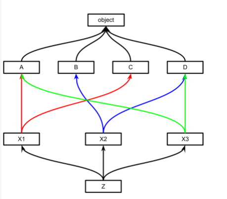

1. Четыре класса A, B, C, D не имеют родительского класса. Точнее они
наследуются от прародителя object. У каждого из классов есть по параметру.
2. Далее три класса X имеют по два родительских класса.
3. В финале класс Z наследуется от трёх классов X.
У каждого класса добавили текстовый вывод при вызове методу __init__. Также
обратите внимание на наличие функции super, которая вызывает инициализацию
родительского класса.
На схеме наследование будет выглядеть так:

У каждого класса есть метод mro, который вычисляет порядок наследования. Он
отвечает за инициализацию каждого класса один раз в порядке слева направо и по
старшинству, т.е. родитель не может быть инициализирован раньше дочернего
класа.. Подробнее про то как работает “монотонная линеаризация суперкласса”
можно прочитать по [ссылке](https://ru.wikipedia.org/wiki/C3-линеаризация).

Разберём результат работы mro с нашим классом Z.

● В первую очередь отрабатывает инициализация самого класса.

● Далее начинаем двигаться слева направо по списку родительских классов:
X1, X2

● Следующим будет класс B. Почему он, а не X3? Класс B является
родительским только для класса X2. Так мы не нарушаем порядок слева
направо и старшинство.

● Следующим инициализируется X3, последний из родительских классов у Z.

● Далее идёт инициализация класса A. Он родитель для X1 и X3. Следовательно
его инициализация была невозможна раньше дочерних классов.

● Классы С и D инициализируются последними, они правее A, B и С в списке
родительских классов у “иксов”.

● Класс object всегда инициализируется в последнюю очередь

Поиск аргументов и методов в экземпляре класса Z будет происходить в порядке,
представленном методом mro.
Добавим несколько строк кода и посмотрим на результат:

z = Z()
print(f'{z.data_b = }')
print(f'{z.data_a = }') # AttributeError: 'Z' object has no
attribute 'data_a'

